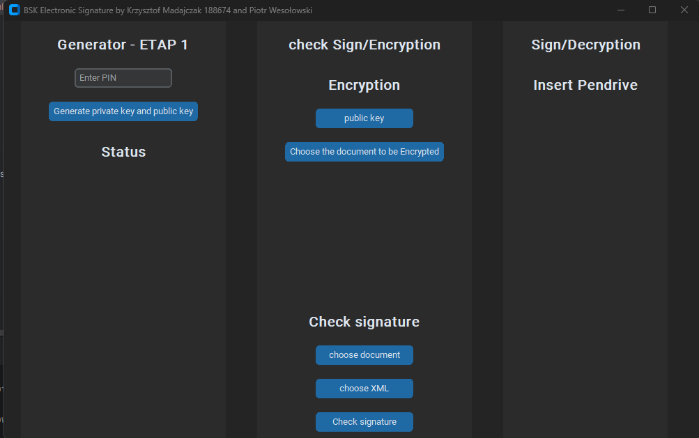
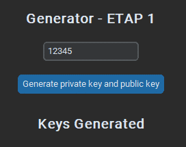
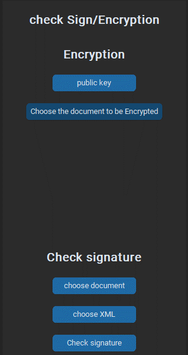
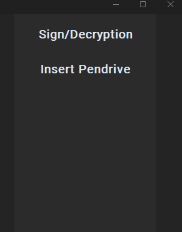
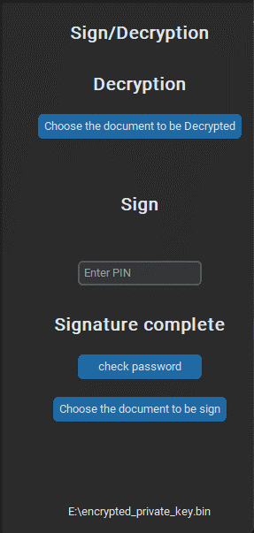

# 🔒 Secure File Management System

## 📖 Overview

This Python application provides a comprehensive solution for secure file encryption, decryption, and digital signature verification using RSA encryption and SHA-256 hashing. It ensures data security and integrity through key functionalities such as RSA key pair generation, file encryption and decryption, and digital signing and verification.

## 🚀 Key Features

- **🔑 RSA Key Pair Generation**: Generates a pair of RSA keys (private and public) with a key size of 4096 bits. The private key is encrypted with a user-defined password for added security.
- **🗄️ File Encryption**: Encrypts files using the recipient's public key, ensuring only the intended recipient can decrypt and access the file.
- **🔓 File Decryption**: Decrypts files using the private key, protected by a password.
- **✒️ Digital Signing**: Creates a digital signature for a file by hashing the file content using SHA-256 and encrypting the hash with the user's private key. The digital signature is stored in an XML file.
- **✔️ Signature Verification**: Verifies the integrity and authenticity of a signed file by comparing the decrypted hash from the digital signature with a newly generated hash of the received file.

## 🛠️ Installation

### 🐍 Creating Conda Environment from `environment.yml`

1. Ensure you have Conda installed. You can download it from [Conda's official website](https://docs.conda.io/en/latest/miniconda.html).

2. Create a new environment using the provided `environment.yml` file:

    ```sh
    conda env create -f environment.yml
    ```

3. Activate the newly created environment:

    ```sh
    conda activate BSK
    ```

## 🖥️ Preview of the App



### 🔑 Generate Private and Public Key



### 🔐 Encryption and Checking the Signature
- Must have public key



### 💾 Access This Section with Private Key
- No private key



- Pendrive with private key inserted:


